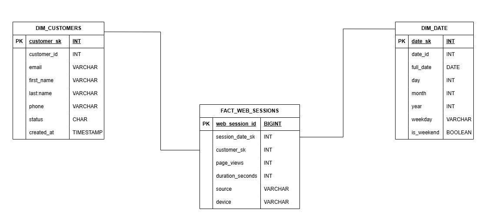
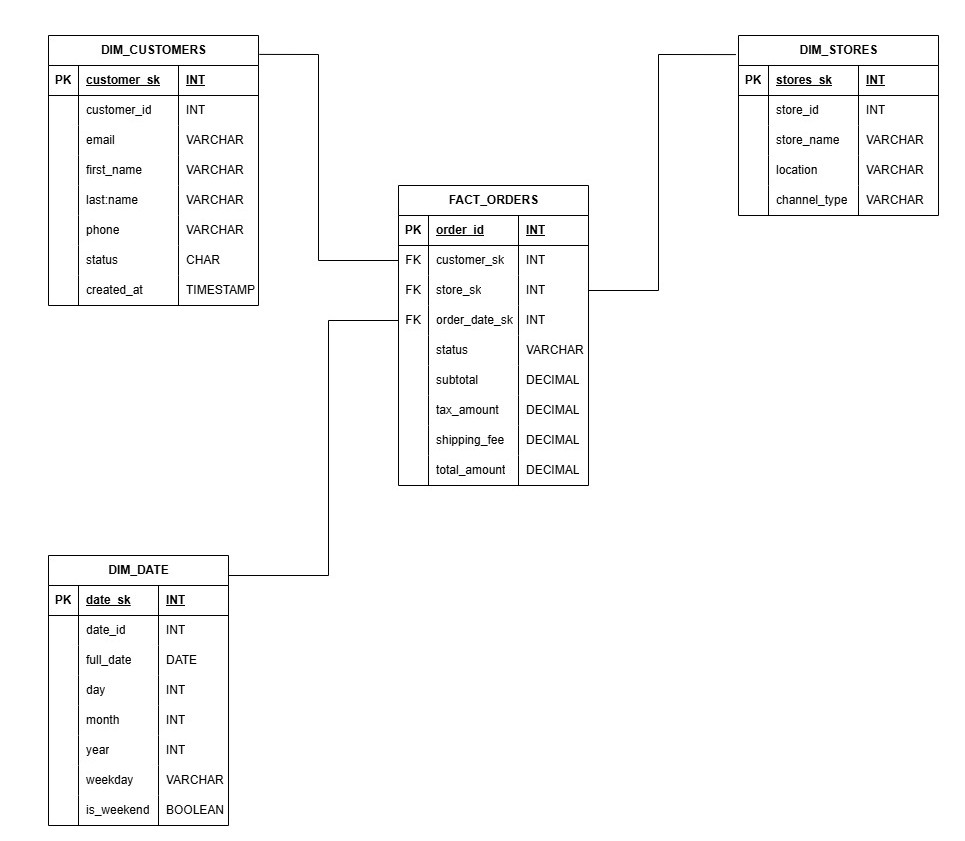
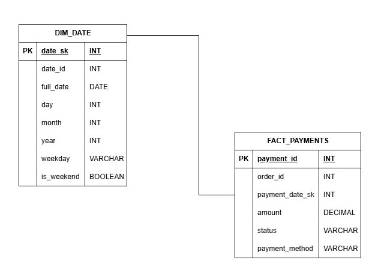
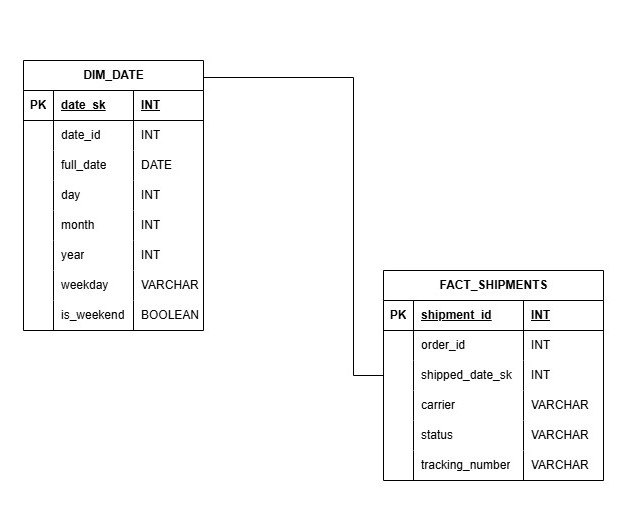
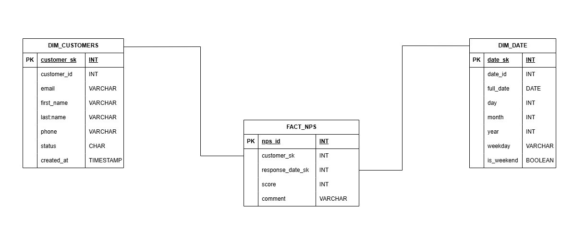

# Trabajo Práctico Final — Introducción al Marketing Online y los Negocios Digitales

Repositorio del trabajo práctico final de la materia.

**Consigna y documento principal:** [Trabajo Práctico Final](https://docs.google.com/document/d/15RNP3FVqLjO4jzh80AAkK6mUR5DOLqPxLjQxqvdzrYg/edit?usp=sharing)
**Diagrama Entidad Relación:** [DER](./assets/DER.png)

📘 README — Proyecto de Data Warehouse (ETL en Python)
🧩 Supuestos

El proyecto fue desarrollado bajo los siguientes supuestos:

⚙️ Entorno de Ejecución

Python 3.10 o superior.

Todas las librerías necesarias están instaladas (pandas, pyarrow, etc.).

El script se ejecuta desde la raíz del proyecto.

🏗️ Estructura del Proyecto

El proyecto sigue una estructura ETL clásica:

* `raw/`: Contiene los archivos de la OLTP.
* `etl/`: Contiene los scripts del proceso de ETL, seprarada en:
    * `etl/extract/`: Contiene el script para leer los datos desde `raw/`.
    * `etl/transform/`: Contiene los scripts para desnormalizar la OLTP en DIM y FACT tables.
    * `etl/load/`: Contiene el script de pipeline para guardar las DIM y FACT tables.
* `main.py`: El script principal que ejecuta el pipeline.
* `werehouse/` (¡Ojo! Quizás quisiste poner `warehouse/`): Contiene los archivos creados para el OLAP, se divide en:
    * `werehouse/dim/`: Contiene las tablas de dimensiones.
    * `werehouse/fact/`: Contiene las tablas de hechos.


## 🚀 Instrucciones de Ejecución

Siga estos pasos para ejecutar el pipeline de ETL localmente:

1.  **Clonar el repositorio:**

    ```bash
    git clone https://github.com/SantinoMalatini/mkt_tp_final.git
    cd mkt_tp_final
    ```

2.  **Crear y Activar un Entorno Virtual (ENV):**

    * **En macOS/Linux:**
        ```bash
        python -m venv .venv
        source .venv/bin/activate
        ```

    * **En Windows (PowerShell/CMD):**
        ```powershell
        python -m venv .venv
        .\.venv\Scripts\activate
        ```

3.  **Instalar Dependencias:**

    ```bash
    pip install -r requirements.txt
    ```

4.  **Ejecutar el pipeline ETL:**

    ```bash
    python main.py
    ```

🗃️ Diccionario de Datos — Data Warehouse

El Data Warehouse está compuesto por 6 dimensiones y 6 tablas de hechos, siguiendo un modelo de esquema estrella (Star Schema).

## 🧱 DIMENSIONES

---

### 🧩 `dim_customers.csv`

Contiene información de los clientes.

| Columna | Descripción | Tipo de dato |
|---|---|---|
| `customer_sk` | Clave subrogada (PK) | `INT` |
| `customer_id` | Identificador original del cliente | `INT` |
| `first_name` | Nombre del cliente | `VARCHAR` |
| `last_name` | Apellido del cliente | `VARCHAR` |
| `email` | Correo electrónico | `VARCHAR` |
| `phone` | Teléfono | `VARCHAR` |
| `created_at` | Fecha de alta del cliente | `TIMESTAMP` |

---

### 🧩 `dim_products.csv`

Información de productos y su categoría.

| Columna | Descripción | Tipo de dato |
|---|---|---|
| `product_sk` | Clave subrogada (PK) | `INT` |
| `product_id` | ID original del producto | `INT` |
| `name` | Nombre del producto | `VARCHAR` |
| `sku` | Código SKU del producto | `VARCHAR` |
| `price` | Precio unitario | `DECIMAL` |
| `category_id` | ID de categoría | `INT` |
| `created_at` | Fecha de alta del producto | `TIMESTAMP` |

---

### 🧩 `dim_stores.csv`

Información de las tiendas físicas o canales de venta.

| Columna | Descripción | Tipo de dato |
|---|---|---|
| `store_sk` | Clave subrogada (PK) | `INT` |
| `store_id` | Identificador original de la tienda | `INT` |
| `name` | Nombre de la tienda o canal | `VARCHAR` |
| `type` | Tipo de tienda (online / física) | `VARCHAR` |
| `region` | Región o zona geográfica | `VARCHAR` |

---

### 🧩 `dim_date.csv`

Dimensión temporal utilizada para análisis por día.

| Columna | Descripción | Tipo de dato |
|---|---|---|
| `date_sk` | Clave subrogada (PK) | `INT` |
| `date_id` | Fecha numérica (AAAAMMDD) | `INT` |
| `date` | Fecha completa | `DATE` |
| `day` | Día del mes | `INT` |
| `month` | Mes | `INT` |
| `year` | Año | `INT` |
| `weekday` | Día de la semana (0=Monday) | `INT` |

---

### 🧩 `dim_product_category.csv`

Categorías de los productos.

| Columna | Descripción | Tipo de dato |
|---|---|---|
| `product_category_sk` | Clave subrogada (PK) | `INT` |
| `category_id` | ID original de categoría | `INT` |
| `category_name` | Nombre de la categoría | `VARCHAR` |

---

## 📊 TABLAS DE HECHOS

---

### 💰 `fact_order_lines.csv`

Registra el detalle de cada línea de pedido.

> **Grano:** una línea de producto en una orden.

| Columna | Descripción | Tipo de dato |
|---|---|---|
| `order_id` | Identificador de la orden | `INT` |
| `order_date_sk` | Fecha del pedido (FK a dim_date) | `INT` |
| `customer_sk` | Cliente (FK a dim_customers) | `INT` |
| `product_sk` | Producto (FK a dim_products) | `INT` |
| `store_sk` | Tienda (FK a dim_stores) | `INT` |
| `quantity` | Cantidad | `INT` |
| `unit_price` | Precio unitario | `DECIMAL` |
| `line_total` | Total de la línea (cantidad × precio) | `DECIMAL` |

---

### 🧾 `fact_orders.csv`

Registra información a nivel de orden completa.

> **Grano:** una orden de venta.

| Columna | Descripción | Tipo de dato |
|---|---|---|
| `order_id` | Identificador de la orden (PK) | `INT` |
| `order_date_sk` | Fecha del pedido (FK a dim_date) | `INT` |
| `customer_sk` | Cliente (FK a dim_customers) | `INT` |
| `store_sk` | Tienda (FK a dim_stores) | `INT` |
| `status` | Estado de la orden | `VARCHAR` |
| `subtotal` | Subtotal de la orden | `DECIMAL` |
| `tax_amount` | Impuestos aplicados | `DECIMAL` |
| `shipping_fee` | Costo de envío | `DECIMAL` |
| `total_amount` | Total final | `DECIMAL` |

---

### 💳 `fact_payments.csv`

Registra los pagos asociados a las órdenes.

> **Grano:** un pago realizado por un cliente.

| Columna | Descripción | Tipo de dato |
|---|---|---|
| `payment_id` | Identificador del pago (PK) | `INT` |
| `order_id` | Orden asociada | `INT` |
| `payment_date_sk` | Fecha del pago (FK a dim_date) | `INT` |
| `amount` | Monto del pago | `DECIMAL` |
| `status` | Estado del pago | `VARCHAR` |
| `payment_method` | Método de pago | `VARCHAR` |

---

### 📦 `fact_shipments.csv`

Registra los envíos de los pedidos.

> **Grano:** un envío realizado.

| Columna | Descripción | Tipo de dato |
|---|---|---|
| `shipment_id` | Identificador del envío (PK) | `INT` |
| `order_id` | Orden asociada | `INT` |
| `shipped_date_sk` | Fecha de envío (FK a dim_date) | `INT` |
| `carrier` | Empresa de transporte | `VARCHAR` |
| `status` | Estado del envío | `VARCHAR` |
| `tracking_number` | Número de seguimiento | `VARCHAR` |

---

### 🌐 `fact_web_sessions.csv`

Registra las sesiones de usuarios en la web.

> **Grano:** una sesión iniciada por un cliente.

| Columna | Descripción | Tipo de dato |
|---|---|---|
| `session_id` | Identificador de la sesión (PK) | `INT` |
| `customer_id` | Cliente (FK a dim_customers) | `INT` |
| `session_date_sk` | Fecha de la sesión (FK a dim_date) | `INT` |
| `page_views` | Páginas vistas | `INT` |
| `duration_seconds` | Duración en segundos | `INT` |

---

### ⭐ `fact_nps.csv`

Registra las respuestas de encuestas de satisfacción (NPS).

> **Grano:** una respuesta por cliente.

| Columna | Descripción | Tipo de dato |
|---|---|---|
| `nps_id` | Identificador de la respuesta (PK) | `INT` |
| `customer_id` | Cliente (FK a dim_customers) | `INT` |
| `response_date_sk` | Fecha de respuesta (FK a dim_date) | `INT` |
| `score` |

Diagramas Star Schema
Se crearon los Star Schema para cada tabla de hechos

fact_ order_lines



fact_orders



fact_payments



fact_shipments



fact_web_sessions


fact_nps




## 📈 Modelo Estrella — Resumen

Esta tabla resume las relaciones entre las tablas de hechos (Facts) y las tablas de dimensiones (Dimensions) que componen el Data Warehouse.

| FACT TABLE | DIMENSIONES RELACIONADAS |
|---|---|
| `fact_order_lines` | `dim_customers`, `dim_products`, `dim_stores`, `dim_date`, `dim_orders` |
| `fact_orders` | `dim_customers`, `dim_stores`, `dim_date` |
| `fact_payments` | `dim_date`, `dim_customers` |
| `fact_shipments` | `dim_date` |
| `fact_web_sessions` | `dim_customers`, `dim_date` |
| `fact_nps` | `dim_customers`, `dim_date` |
